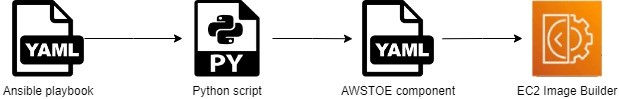
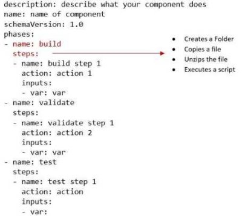

# Convert Ansible playbooks for AMI creation into EC2 Image Builder component documents**

### NOTE: TODO: Document my PRODUCTION Python code in Boto3/Lambda to automate creation and updating of Golden AMI and production Docker in ECR. (inspired by this AWS Blog) 

How to automate the conversion of Ansible playbooks into [EC2 Image Builder components](https://docs.aws.amazon.com/imagebuilder/latest/userguide/how-image-builder-works.html). where the amount of Ansible playbooks is considerable and manually creating an equivalent [AWS Task Orchestrator and Executor (AWSTOE)](https://docs.aws.amazon.com/imagebuilder/latest/userguide/toe-get-started.html) component for each playbook becomes a time-consuming and error-prone task.

[Packer](https://www.packer.io/) and [Ansible](https://www.ansible.com/overview/how-ansible-works) to EC2 Image Builder required two steps:

- Step 1: Migrate the AMI image pipeline to EC2 Image Builder. To know more about this, I recommend reading this post: [Migrating from HashiCorp Packer to EC2 Image Builder](https://aws.amazon.com/blogs/mt/migrating-from-hashicorp-packer-to-ec2-image-builder/).
- Step 2: Convert Ansible playbooks into AWSTOE components.

The second step is the focus of this blog post. As an example, I use a playbook that hardens a Windows Server 2022 AMI using the Microsoft security baseline. Although the commands I present are for Windows, you may adapt them to Linux environments as well.

**Solution overview**

A Python script reads an Ansible playbook YAML file, loads it as a Python dictionary, modifies it, and exports the equivalent AWSTOE component YAML file. This output file is used to create an AWSTOE component in EC2 Image Builder.



**Prerequisites**

- Basic knowledge of Ansible, EC2 Image Builder, and Python development
- Programmatic access to an [AWS account](https://signin.aws.amazon.com/signin?redirect_uri=https%3A%2F%2Fportal.aws.amazon.com%2Fbilling%2Fsignup%2Fresume&client_id=signup) with permissions to write buckets and objects to Amazon S3 and create components on EC2 Image Builder
- Python 3.9+
- A code editor. In this post, I will use Visual Studio Code.

**Solution walk-through**

Follow these steps:

- Step 1: Create an Ansible playbook
- Step 2: Define the YAML component document structure
- Step 3: Map Ansible modules and parameters to AWSTOE actions and input variables
- Step 4: Create the Python script
- Step 5: Add the validate and test phases, then export the YAML file
- Step 6: Execute Python script
- Step 7: Create an EC2 Image Builder component

**Step 1: Create an Ansible playbook**

First, create an Ansible playbook. This is a YAML file composed of a sequence of tasks that apply a configuration. Tasks use [modules](https://docs.ansible.com/ansible/latest/user_guide/modules.html) to execute pre-defined actions on a target operating system.

1. Open Visual Studio Code and create a new file with the name ***playbook.yml**.*
2. Paste the following code into the file.

\- name: Create Microsoft Security Baseline directory
```bash
    win\_file:
        path: C:\Installers\MicrosoftBaseline\
        state: directory
\- name: Copy Microsoft Security Baseline Files
    win\_copy:
        src: Windows-Server-2022-Security-Baseline.zip
        dest: C:/Installers/MicrosoftBaseline/Windows-Server-2022-Security-Baseline.zip
\- name: Unzip Custom GPO
    win\_unzip:
        src: C:/Installers/MicrosoftBaseline/Windows-Server-2022-Security-Baseline.zip
        dest: C:/Installers/MicrosoftBaseline/
\- name: Apply Microsoft Security Baseline
    win\_shell: C:\Installers\MicrosoftBaseline\Windows-Server-2022-Security-Baseline-FINAL\Scripts\Baseline-LocalInstall.ps1 -WSNonDomainJoined
```
YAML

To install the Microsoft security baseline, this playbook performs the following basic tasks:

- Creates a Folder
- Copies a file
- Unzips the file
- Executes a script

Many playbooks follow the same structure, so this approach can work for other use cases, too.

**Step 2: Define the YAML component document structure**

An AWSTOE component is represented by a YAML component document. This YAML contains these scalars: ***description***, ***name***, ***schemaVersion,*** and the phases list. A component requires a minimum of three phases: ***build***, ***validate***, and ***test***. Each phase has steps, which are the equivalent of Ansible tasks. As you can see in the following code, the AWSTOE component build phase contains the four Ansible tasks you created in the first step. This is where you add the converted YAML.



**Step 3: Map Ansible modules and parameters to AWSTOE actions and input variables**

For each Ansible module in the Ansible playbook, you map an equivalent AWSTOE action module that executes the same action. For a full list of action modules, check the list of [Action modules supported by AWSTOE component manager](https://docs.aws.amazon.com/imagebuilder/latest/userguide/toe-action-modules.html).

To parameterize each task, Ansible uses parameters while AWSTOE uses input variables. Map each Ansible module with its parameters to a corresponding AWSTOE Action module and its input variables, as shown in Table 1.

|Table 1. Mapping of Ansible modules to EC2 Image Builder components |||
| :-: | :- | :- |
|**Action**|**Ansible(YAML)**|**AWSTOE Component(YAML)**|
|Create a folder|win\_file:<br>`    `path: "Path in host"|CreateFolder:<br>`        `path: "Path in host"|
|Copy file|win\_copy:<br>`     `src: "Path local"<br>`    `dest: "Path in host"|S3Download:<br>`     `source: "S3 Object URI"<br>destination: "Path in host"|
|Unzip the file|win\_unzip:<br>`     `path: "Path in host"|ExecutePowerShell:<br>`         `commands: "Inline shell code"|
|Execute a script|win\_shell:<br>`   `parameter: "Inline shell code"|ExecutePowerShell:<br>`  `commands: "Inline shell code"|

**Step 4: Create the Python script**

1. Open Visual Studio Code and create a file with the name app.py
2. Add this code to app.py

import yaml, json

\# Load the Ansible playbook as a dictionary

with open('/home/andres/devlocal/playbookToComponent/playbook.yaml') as f:

`         `playbook = yaml.load(f, Loader=yaml.FullLoader)

\# Helper functions used to format the YAML file

def append\_to\_build\_steps(action):

`      `build\_steps.append({"name" : task['name'],"action":action})

def add\_to\_build\_steps(action,var):

`      `if action == "ExecutePowerShell":

`         `build\_steps[-1].update({"inputs":var})

`      `else:

`         `inputs= []

`         `inputs.append(var)

`         `build\_steps[-1].update({"inputs":inputs})

\# Loop through the Ansible Playbook and convert according to the Ansible Module - AWSTOE Action mapping table

build\_steps = []

for task in playbook:

`    `for key in task:

`        `if key == "win\_file":

`           `action = "CreateFolder"

`           `var = {"path":task['win\_file']['path']}

`           `append\_to\_build\_steps(action)

`           `add\_to\_build\_steps(action,var)

`        `elif key == "win\_copy":

`           `action = "S3Download"

`           `var = {"source":"s3://my-awstoe-component-configs/"+task['win\_copy']['src'],"destination":task['win\_copy']['dest']}

`           `append\_to\_build\_steps(action)

`           `add\_to\_build\_steps(action,var)

`        `elif key == "win\_unzip":

`           `action = "ExecutePowerShell"

`           `var = {"commands":["Expand-Archive -LiteralPath "+task['win\_unzip']['src']+" -DestinationPath c:\\Installers"]}

`           `append\_to\_build\_steps(action)

`           `add\_to\_build\_steps(action,var)

`        `elif key == "win\_command":

`           `action = "ExecutePowerShell"

`           `var = {"commands":[ task['win\_command']]}

`           `append\_to\_build\_steps(action)

`           `add\_to\_build\_steps(action,var)

Python

**Step 5: Add the validate and test phases, then export the YAML file**

You can add your own validation and tests, but for the goal of this post, these phases will execute a “Hello world” statement. At the end, you will export your output to a new YAML file.

1. Add this code at the end of app.py

\# Add the validate and test phases

phases=[]

phases.append({

`    `'name': 'validate',

`    `'steps': [{

`      `'name': 'HelloWorldStep',

`      `'action': 'ExecutePowerShell',

`      `'inputs': {

`                 `'commands': ['echo "Hello World! Validate."']

`                `}

`     `}]

})

phases.append({

`    `'name': 'test',

`    `'steps': [{

`      `'name': 'HelloWorldStep',

`      `'action': 'ExecutePowerShell',

`      `'inputs': {

`                 `'commands': ['echo "Hello World! Test."']

`                `}

`      `}]

})

awstoe\_final = {'name':'WindowsServer2022SecurityBaseline',

`                `'description': 'Install Sec Baseline for WS2022',

`                `'schemaVersion': 1.0,

`                `'phases':phases}

\# Export the resulting YAML

with open('component\_config.yaml', 'w') as fp:

`     `yaml.dump(awstoe\_final, fp)

Python

**Step 6: Execute Python script**

Open a command line or PowerShell prompt located in the path where you stored py (in this example, it’s C:\Temp) and execute the following commands:

C:\Temp> python -m venv .venv

C:\Temp> .venv\Scripts\activate.bat

C:\Temp> pip install pyyaml

C:\Temp> python ./app.py

The script generates a file with the name ***component\_config.yaml.***

You need to upload this file to an existing Amazon S3 bucket. You can do it using this AWS Command Line Interface (AWS CLI) command or directly in the AWS Management Console:

C:\Temp> aws s3 cp component\_config.yaml s3://your-s3-bucket --region <YOUR\_AWS\_REGION>

**Step 7: Create an EC2 Image Builder component**

First, create a file named ***image\_component\_config.json***. Make sure the Amazon S3 URI points to a valid URI.

{

`  `"name": "MicrosoftSecurityBaselineWS2022",

`  `"semanticVersion": "1.0.0",

`  `"description": "MicrosoftSecurityBaselineWS2022",

`  `"changeDescription": "Initial Version.",

`  `"platform": "Windows",

`  `"uri": "s3://your-s3-bucket/component\_config.yaml",

`  `"tags": {

`            `"App": "MicrosoftSecurityBaselineWS2022Component"

`   `}

}

Next, create the component:

C:\Temp> aws imagebuilder create-component \

`         `file://image\_component\_config.json \

`         `--region <YOUR\_AWS\_REGION>

**Cleanup**

To avoid incurring future charges, perform the following steps:

First, list all components and retrieve your component’s ARN. To do this, run the following command, which lists all of the available components for a particular region in JSON format.

C:\Temp> aws imagebuilder list-components --region <YOUR\_AWS\_REGION>

Look for the component you created and copy its ARN.

{

> "requestId": XXXXX,

. "componentVersionList": [

> >{

`            `"arn": <YOUR\_COMPONENT\_ARN>,

`            `"name": "MicrosoftSecurityBaselineWS2022",

`            `"version": "1.0.0",

`            `"description": "MicrosoftSecurityBaselineWS2022",

`            `"platform": "Windows",

`            `"type": "BUILD",

`            `"owner": XXXXX,

`            `"dateCreated": XXXXX

`        `}

`    `]

} 

JSON

Delete the component.

C:\Temp> aws imagebuilder delete-component --component-build-version-arn <YOUR\_COMPONENT\_ARN> --region <YOUR\_AWS\_REGION>

**Conclusion**

The conversion of Ansible playbooks into EC2 Image Builder components can be automated using Python scripts. The example follows common use case in configuration management
(1) create an [Image Recipe](https://docs.aws.amazon.com/imagebuilder/latest/userguide/manage-recipes.html) that defines a base image (Windows Server 2019 Base, 2022 with SQL Server, etc.) and can combine your custom components with AWS-managed components. 
(2) all [resources](https://docs.aws.amazon.com/imagebuilder/latest/userguide/manage-resources.html) (components, recipes, images, infrastructure configurations and distribution settings) come together as an [EC2 Image Builder Pipeline](https://docs.aws.amazon.com/imagebuilder/latest/userguide/start-build-image-pipeline.html).

-----
[Windows on AWS](http://aws.amazon.com/windows).

